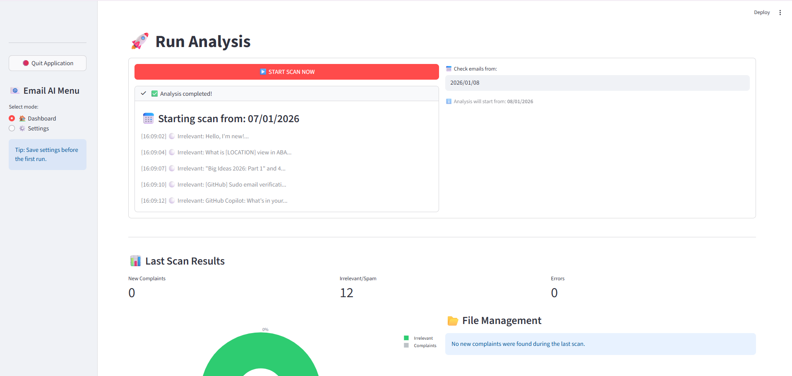
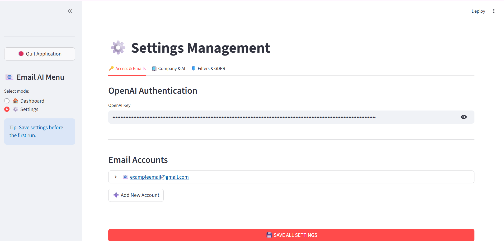

# AI-Email-Insights
An AI-driven communication analyst that leverages LLMs to identify latent client needs and service risks, preventing oversight by automatically logging actionable insights into Excel.\\
This project was originally commissioned by a Greek company to automate this specific challenge. Upon completion, I decided to generalize it and release the source code to the public. By making this project **Open Source**, I aim to provide the community with a production-ready tool and encourage further innovation and collaboration in the field of AI-assisted business automation and privacy.

---

## 🖼️ Screenshots
| **Main Dashboard & Analysis** | **Settings & Configuration** |
|:---:|:---:|
|  |  |
| *Real-time scan logs and sentiment metrics* | *API configuration and GDPR filter settings* |

---

## ✨ Key Features
* **Stealth LLM Integration:** Uses advanced prompt engineering to process emails via GPT-4o-mini without exposing the underlying AI complexity to the end-user.
* **GDPR-Compliant Anonymization:** Automatically detects and masks Names (PER), Locations (LOC), and Organizations (ORG) using **spaCy's** multilingual NLP models before processing data.
* **Automated Excel Reporting:** Generates professionally formatted and filtered Excel reports using **XlsxWriter**, prioritizing critical client complaints.
* **Modern UI Dashboard:** A fully interactive interface built with **Streamlit** for easy configuration and real-time monitoring.

---

## 🛠️ Tech Stack
* **Language:** Python 3.10+
* **Frontend/UI:** Streamlit
* **AI/LLM:** OpenAI API (GPT-4o-mini)
* **NLP:** spaCy (Multilingual NER model)
* **Email Handling:** imap-tools
* **Data Processing:** Pandas, XlsxWriter, Plotly

---

## 🚀 Installation & Setup

### 1. Clone the Repository
git clone https://github.com/ApoNikol/AI-Email-Insights.git
cd AI-Email-Insights

### 2. Create a Virtual Environment (Recommended)
# Windows
python -m venv venv
.\venv\Scripts\activate
# Mac/Linux
python3 -m venv venv
source venv/bin/activate

### 3. Install dependencies
pip install streamlit pandas openai plotly imap-tools spacy xlsxwriter

### 4. Download NLP Models
python -m spacy download xx_ent_wiki_sm

### 5. Running the application
streamlit run runner.py

### 6. Create Pyinstaller exe (Optional)
pip install pyinstaller
pyinstaller --noconfirm --onefile --name "AI_Email_Insights" --icon "gmail_ico.ico" --collect-all streamlit --collect-all spacy --collect-all xx_ent_wiki_sm --collect-all openai --collect-all pandas --collect-all imap_tools --collect-all plotly --collect-all openpyxl --collect-all xlsxwriter --add-data "ui.py;." --add-data "main_script.py;." --add-data "gmail_ico.ico;." runner.py
